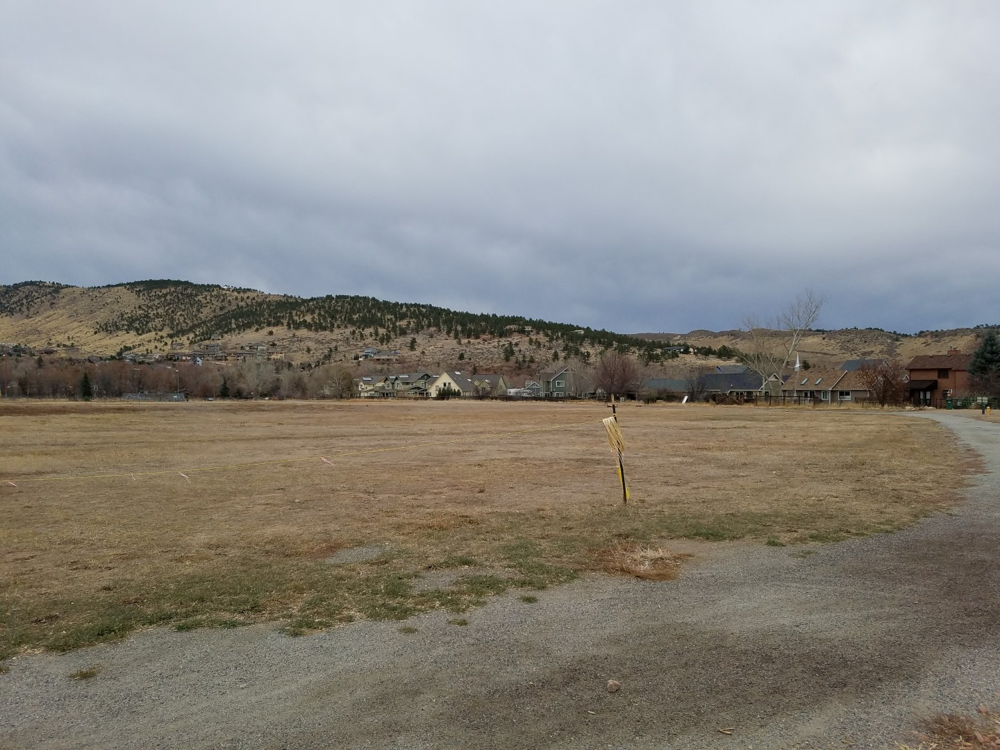

6.0 Alternative Analysis
========================

6.1 Alternative Development Process
-----------------------------------

An Alternative Analysis was completed to develop flood mitigation
solutions for the problem areas identified in the previous section.
Goals for mitigation focused a minimum condition to provide storm
drainage capacity meeting currently defined drainage criteria for the
Town of Lyons and solutions to reducing flooding on insurable
structures. Consideration was also given to reducing infrastructure
sizing and costs by incorporating detention.

Alternatives were considered first for open channel and then for piped
systems. Open channels are more cost effective, provide additional
ecological benefits, mimic or sometimes restore the natural environment,
but require additional stabilization and maintenance to provide long
term benefits. Piped systems are far more hydraulically efficient and
allow for more flexible land uses in and around the system, but do not
benefit the natural environment and can be significantly more costly to
install, particularly in underlying rock soils.

For example, the development of downtown Lyons over the historic
drainageway has limited the ability to convey the major storm events
through an open channel system. Since an open channel system is not
feasible, large storm drain infrastructure is needed to reduce the flood
hazards throughout the study area. The storm drain infrastructure must
limit the amount of flow in the street to provide emergency vehicles
access during storm events.

The analysis aimed to develop stormwater solutions first within the Town
of Lyons. When those alternatives were exhausted as cost prohibitive or
unfeasible, then the project team considered alternatives outside of the
Town limits. The cost of land acquisition, land use regulations, and
extra-territorial jurisdiction can add significant costs to stormwater
projects outside of the Town limits. Conversely, knowing about potential
out of town solutions to in-town risks can be prudent to future planning
exercises in annexation, development referrals, and multi-agency
coordination.

6.2 Criteria and Constraints
----------------------------

As noted above, goals for the baseline alternative plan was to provide
storm drainage capacity to meeting currently defined drainage criteria
set forth in the Town of Lyons Storm Drainage System Criteria. The minor
storm frequency for the Town of Lyons is the 2-yr design storm with the
100-yr design storm classified as the major storm frequency.

6.3 Evaluation of Detention
---------------------------

#### 6.3.1 Detention

Detention is a common approach to reduce peak flows, optimize pipe size,
and save on downstream infrastructure costs. Review of the previous
master plan confirmed that previously master planned detention
facilities were drafted to meet this goal. If detention is installed in
the upper watersheds of the Town, there is a significant cost savings to
downstream stormwater infrastructure. However, upon closer examination
of the previous master plan assumptions, field inspection of the
proposed detention sites, and conceptual pond grading and layout there
were additional constraints on the detention pond locations.

#### 6.3.2 Steep Topography

The steep slopes on the north end of Steamboat drainage require
significant grading operations to achieve a functional detention volume
even approaching 0.5 acre feet. This fact alone may still be a viable
alternative since excavation is generally less expensive than long
lengths of large storm sewer pipe material, utility crossings, and
installation. However, given the geology of the upper Steamboat drainage
the depth to bedrock is known to be very shallow in many locations. Rock
excavation for a detention facility is prohibitively expensive.
Excavation of the rock in a quarry scenario would be one economically
viable means of providing sufficient detention volume at a reasonable
cost for Steamboat drainage.

#### 6.3.3 Multiple Hillside Ponds

Staged detention facilities staggered in stair-step fashion up the steep
slopes is another alternative to achieve the benefits of detention
without significant excavation. However, the extensive footprint of
disturbance for multiple embankments, overflow spillway design, and
permanent impact on property makes

#### 6.3.4 Property Acquisition

The natural valleys between 4th and 5th Streets
and 3rd and 4th Streets could provide suitable
detention facilities if several existing constraints are mitigated.
First, the private homes in the adjacent parcels would be impacted by
detention depths of more than approximately 5 feet. Purchase and
demolition of homes affected by a proposed detention facility would be
required to achieve a useful detention volume. Second, the existing
embankments between 4th and 5th Street should be
reconstructed to replace the rock and native soils that were used to
build what is reported to be an old railroad embankment. Until the
compaction and stability of that embankment can be verified, it should
not be relied upon to safely detain stormwater. It is unclear what the
overflow path may be should the outlet under the embankment fail,
collapse or clog. However it is likely the overflow could lead to
additional erosion and scour of the embankment flanks and expedite
complete failure of the embankment. Third, the valleys near the cemetery
are also candidates for detention, but the steep slopes make each valley
individually difficult to achieve a reasonable volume. However, purchase
of a uniquely shaped parcel of land slicing between the valleys could
allow an embankment to be constructed that joins the two valleys and
creates a reasonable detention volume.

6.4 Alternative Categories
--------------------------

For each outfall system, multiple alternatives were evaluated in the
initial screening process including:

-   Improve storm drain infrastructure to convey minor storm runoff

-   Improve storm drain infrastructure to the initial storm, and provide
    detention facilities to reduce infrastructure costs where applicable

-   Improve storm drain infrastructure to the major storm runoff.

-   Improve storm drain infrastructure to the major storm, and provide
    detention facilities to reduce infrastructure costs where applicable

6.5 Alternative Hydraulics
--------------------------

Each alternative was modeled using SWMM to determine the pipe sizes
necessary to meet the desired alternative criteria. The reduction in
flooding potential throughout the basin was evaluated for the minor and
major design storm frequencies using FLO-2D.

6.6 Alternative Costs
---------------------

Alternative cost estimates were developed using UDFCD's master planning
cost estimating spreadsheet UD-MP COST, version 2.2. 2012 unit cost
values were adjusted to present value using the Colorado Construction
Cost Index 2016 Second Quarter Report. A rolling four-quarter inflation
rate of 1.2673 was used to adjust unit costs.

Operation and Maintenance was also included within the UD MP Cost
worksheet. Manhole and inlet maintenance was assumed to occur once every
five years. Maintenance on detention basins and water quality facilities
was assumed to occur every other year.

Inlet quantities were calculated assuming an inlet interception capacity
of 1 cfs / foot of inlet.

Dewatering, Traffic Control and Utility Coordination / Relocation were
assigned based on the following percentages of capital costs: Dewatering
(1%), Traffic Control (5%), Utility Coordination / Relocation (10%).

Special items that were added to the UD-MP COST spreadsheet include:

-   Asphalt Repaving: $40 / S.Y.

-   Curb and Gutter: $30 / L.F.

No alterations were made to default values calculated as a percent of
Capital Improvement Costs, such as Engineering, Legal / Administrative,
Contract Administration / Construction Management, and Contingency.

6.7 Alternative Plans
---------------------

#### A - Red Hill Gulch Overflow Channel East

[{: .center-img }](assets/img/6-7a.jpg){: target="_blank" } 
*Red Hill Gulch Overflow Channel East would intercept flows  
before diverting runoff into Lyons Valley Park Subdivision*
{: .caption }

Any flow that exceeds the capacity of the South Ledge Ditch poses a
flooding hazard to Lyons Valley Subdivision and Bohn Park. This
uncontrolled spill flow risks the structural integrity of the ditch and
poses a hazard to homes along the west side of Lyons Valley Park. The
Red Hill Gulch Overflow Channel would intercept flows along the east
side of Bohn Park preventing these flows from diverting into the Lyons
Valley Park Subdivision. The grading associated with the overflow
channel would change the surface conditions of the east side of the park
but still allow for parking and multi-purpose uses. The multiple uses of
this eastern side of the park require the channel to be wider and
flatter that typical conveyance channels in order to maintain the
function of the space for parking and exhibitions.

In general, this option intercepts and conveys large storm events from
Red Hill Gulch before those flows encroach on private property. The
alignment utilizes existing town property and requires no additional
easements or property acquisition.

However, this alternative compromises existing functions of the park
land and assumes upstream development will not have an impact on the
drainage conditions. In other words, solving the Red Hill Gulch drainage
this far down in the watershed costs a lot when compared to what
upstream alternatives may do to reduce stormwater impacts.

#### B - Red Hill Gulch Overflow Channel West

An alternative to the east channel at the downstream end of the
watershed is a western channel. When the Western Corridor is annexed
into the Town of Lyons the overflow channel alignment should be
evaluated to intercept the flows upstream of Bohn Park eliminating any
disturbance to the park. The flows would be conveyed west of Bohn Park
and discharged into South St. Vrain Creek. This is a smaller channel
used for a singular stormwater purpose – it does not have to share uses
with a park or parking lot. The western alignment also conveys water
around Bohn Park and Lyons Valley subdivision.

However, the channel would require an easement or land acquisition from
the adjoining land owners. And, because of the smaller footprint, the
hydraulics of the channel require drop structures to control erosive
velocities.

#### C - Red Hill Gulch Cut-Off Channel

Outside of the Town, there is another problem area and option for
managing Red Hill Gulch stormwater runoff.

A third alternative for Red Hill Gulch drainage intercepts the gulch
flows at the Picture Rock Trailhead and diverts those flows west into
the South St. Vrain. This alternative has the advantage of working a
stormwater solution upstream of existing development and mitigating
flood risk as high up in the watershed as feasible. This is the most
hydraulically efficient alternative in that the diversion distance to
the South St. Vrain is short and the diversion volume is reduced when
compared to downstream alternatives.

However, the constraints on this alternative are compounded by the need
for easement or land acquisition on both public and county open space
property. The details of a diversion in this location will require
careful design and analysis. The surface flows are spread over a large
area, but the right grading could allow just enough water to drain north
through the park area and intercept the remainder to safely divert it
west to the South St. Vrain. Easements and reconstruction of Red Gulch
Road would be required. Existing irrigation ditches in the area compound
problems rerouting surface flows. Any diversion would still have to
cross Ledge Ditch and Meadow Ditch.

There are several roadside ditches and ditch crossings that should be
investigated further. The stormwater flows into Ledge and Meadow ditches
complicate the flow paths for this drainage. Upstream and downstream of
the irrigation ditches, the roadside swales are an important part of
conveying stormwater but need to be maintained to ensure positive
drainage away from the roadway.

#### D - Steamboat Drainage Culvert Replacement

To reduce flooding within the Steamboat Valley Watershed, the existing
historic box culvert could be upsized to convey the design discharge.
Upsizing the existing historic box culvert along the current alignment
between 4th and 5th Avenue would encourage the runoff from the watershed
to follow the historic drainage path. However, implementing this
alternative would require extensive easements as the historic culvert
runs through the downtown area underneath development on private
properties.

#### E - Steamboat Drainage Interceptors

Downstream of the private railroad embankment an interceptor system
could be installed to collect flow at the McCall Alley roadway crossing.
Flows in excess of the existing channel and roadway crossings would be
intercepted and conveyed west to 5th Avenue. The storm drain system
would continue south to North St. Vrain Creek. Intercepting the flow at
McCall Alley would alleviate the flooding on properties downstream by
limiting the flow to the existing infrastructure capacity.

For further protection, an additional lateral could be installed up 5th
Avenue to the drainage roadway crossing at Vasquez Road. The lateral up
to Vasquez Road would intercept flows upstream of the private detention
area, reducing the risk on downstream properties if the embankment was
to fail.

A storm drain system could be installed in 4th Avenue in the lower
portions of the Steamboat Valley Watershed to intercept local runoff and
convey the discharge to the North St. Vrain Creek. This additional storm
drain system would alleviate some of the existing flooding hazard on
properties in the downtown area.

#### F - Third Avenue Inlets and Storm Drain

To mitigate flood hazards associated with the Third Avenue Watershed, a
storm drain is proposed from the upper reaches from Third Avenue east of
the cemetery downstream to the North St. Vrain Creek. A lateral along
Stickney Avenue would intercept the flows from the undeveloped northeast
portion of the watershed that drains southwest into the downtown area.
Continuing the storm drain system south of Main Street would alleviate
some of the burden of the South 2nd Avenue Watershed. Any flows in
excess of the existing storm drain in the Third Avenue Watershed
currently spill in the South 2nd Avenue Watershed.

However, it is important to note that excavation in the northern end of
the Third Avenue basin is likely to encounter rock and other earthwork
complications. Depth of inlets and storm sewers will be limited by
excavation cost, which limits the hydraulic head and increases pipe
size. As pipe size increases, depth to cover the pipe must increase and
become a costly design loop to determine a feasible storm sewer
alignment.

#### G - Lower 3rd Avenue Inlet

Excess surface flows on 3rd Avenue could be conveyed to a
large storm sewer inlet at the existing storm sewers on the southeast
corner of 3rd and Broadway. The existing grated inlets on the
west flowline of 3rd Avenue at Main Street could be improved,
but flows exceeding the capacity of those inlets will continue south on
3rd Avenue. The proposed lower 3rd Avenue inlets
would capture flows from both gutter flowlines to maintain safe street
capacity on the south end of 3rd Avenue during storm events.

The west flowline is also one of the locations where surface flows could
be routed through a minor storm weir into a small volume water quality
pond in the east end of Sandstone Park. The pond would treat ‘first
flush' or the initial runoff volume with larger flows continuing south.

#### H - Third Avenue Drainage Interceptors

Similar to the Steamboat drainage alternative, the surface conveyance on
Third Avenue could be improved instead of excavation and installation of
inlets and pipes. The surface conveyance improvement contains flows
within the Town ROW, gutters, and directs flow south to the river. This
reduces many of the overflows into private property that exceed the
existing roadway swales or smaller curbs. This alternative also reduces
surface flows intercepted at cross street intersections that drain water
into private property and complicate street flows entering Steamboat
drainage.

This alternative does not resolve major storm overflows. The minor
storms are handled with the interceptor gutters and cross pans. However,
when those conveyance paths are at capacity, the overflow will continue
down the natural topography. An inlet and pipe system could be sized to
convey a much larger portion of the major storm event. But, as a
relatively low cost alternative, the benefits are tangible.

#### I - Eastern Lyons - Second Avenue Gutter Interceptor

Recent development within the Eastern Lyons watershed has increased the
runoff from the hillside causing local flooding problems. For larger
events the existing roadway conveyance and roadside swale along 2nd
Avenue does not adequately convey the runoff south along 2nd Avenue
instead diverting flow to the west into the Third Avenue Watershed.
Formalizing the street conveyance by installing curb and gutters and
cross pans in 2nd Avenue would encourage runoff from this watershed to
continue south along 2nd Avenue and not impact properties the Third
Avenue Watershed.

#### J - Eastern Lyons - Second Avenue Inlets and Storm Sewer

To ensure no runoff diverts from the Eastern Lyons Watershed, inlets and
a storm drain pipe can be installed along 2nd Avenue. The storm drain
inlets and pipe in combination with curb and gutter would intercept the
flow and convey the flow south to Main Street.

#### K - Lyons Valley Inlet Improvements

Runoff from the upper portions of the subwatershed sheet flows in a
general northeast direction through the subdivision to St. Vrain Creek.
The storm drain infrastructure installed with the development of Lyons
Valley Park Subdivision is a minor drainage system and lacks capacity to
convey major storm events.

#### L - Lyons Valley South Ditch Improvements

The South Ledge Ditch located south of Lyons Valley Park Subdivision
intercepts runoff from the subwatershed. Formalizing the ditch to convey
stormwater east towards St. Vrain Creek would reduce the tributary area
contributing to the flooding hazards of Lyons Valley Park Subdivision.
If comingling of stormwater and irrigation flows is not desired an
overflow conveyance system intercepting the runoff from the upper
portions of the watershed could be built just downstream of South Ledge
Ditch. This conveyance system could be included as Lyons Valley Park
becomes fully developed.

This alternative should be developed in coordination with the future
development of Lyons Valley. A drainage feature around the south end of
the currently platted lots would benefit the new construction as well as
the existing homes in the neighborhood.

The greatest limitation of this alternative is the operation and
maintenance of the irrigation ditch and the coordination with any future
development. Breaches and overtopping of the existing ditch are likely
to continue to occur given the earthern embankment construction of the
ditch. As the platted future development moves into the final plan
approval process, careful coordination should identify the benefits to
both existing and future homes in the area. And, when the cost of
perimeter surface water conveyance (i.e. swale) is compared to sizing
interior storm inlets and pipes sized to safely capture and convey the
offsite flows, the cost-benefit should resolve any further limitations
of the concept.

#### M - Lyons Valley McConnel Drive Culvert

The impervious area of the school campus leads to nuisance drainage
issues along McConnel Drive. It is unclear how the stormwater runoff is
treated within the school campus, but the roof drains and parking along
the east side of the campus are direct discharge to the west gutter of
McConnel Drive. On-site water quality and detention facilities, perhaps
conversion of part of the irrigated turf areas, would collect, treat,
and attenuate on-site discharges. A pond near the northeast corner of
the site could connect to a new underground storm sewer tied into the
Type R inlets at 2nd Avenue. This would move surface flow,
particularly nuisance flows dribbling winter melt water that freezes
overnight, into the on-site pond and underground, safely conveyed in a
pipe system.

#### N - Ewald Ave - Corona Hill Diversion Ditch

As witnessed in the 1994 event, the Ewald Avenue Watershed poses a
significant flooding hazard to downstream properties within the
watershed. High velocity runoff flow off Corona Hill can carry debris
into the residential neighborhood. Intercepting the flow upstream of the
development and conveying the flow to the south would prevent debris
flow from impacting private properties. The diversion channel south of
the development would require significant energy dissipation to prevent
the discharge from reaching high velocities and eroding the hillside
south of the development. The steep slopes along the hillside would make
construction of any diversion channel difficult.

#### O - Ewald Ave - Corona Hill Street Inlets

An alternative to intercepting flows upstream of the residential
development is formalizing street conveyance and installing storm drain
infrastructure along Prospect Road. The storm drain infrastructure in
combination with curb and gutter improvements would confine the runoff
from Corona Hill to the street limiting the impact to private
properties. Installing additional inlets and laterals along the Prospect
Street storm drain alignment would encourage more water to be conveyed
in the pipe as this system is currently limited by the two inlets near
4th Avenue.

#### P - 2nd Avenue – Kelling Drive Private Improvements

There are past stormwater runoff events that have led to private
property damages (fencing, landscaping, and structural flooding).
Magnitude of the damages has not be investigated as part of this study.
The subject properties, residential structures on the north side of
Kelling Drive and commercial structures on the south side of Kelling
Drive, are near the bottom of a steep southwestern facing slope. Runoff
from the upstream property impervious area is controlled through
downspouts, gutters, landscape swales, street gutters, and storm sewer
systems.

The northern properties appear to have all or most of their foundations
above adjacent grade, positive drainage away from the structure.
However, additional property line swales could convey surface flows
around the structures. The southern properties appear to have adverse
drainage slopes near the building and could benefit from more formalized
drain pans along top or toe of the retaining walls on the north side of
the property. An existing grated inlet in the north flowline of Kelling
Drive could be improved to increase surface water capture, but only
reduces surface flows already in the street.

Support from the Town in terms of permitting, review, and easement
terminology could resolve drainage issues in the vicinity of Kelling
Drive. The installation of swales, inlets, pipes, moving existing
outbuildings, and re-landscaping perimeter swales on each of the
affected lots can be highly effective private improvements that mitigate
the flood risks in this area. However, the work would be on private
property and therefore require special agreements (easements,
cost-sharing, access requirements, or code updates, etc.) for the Town
to participate in design, construction, operation, maintenance, or
financing. Therefore, the town's assistance could come in the form of
coordinating the private efforts to ensure a comprehensive solution is
achieved.

#### Q - 2nd Avenue – Kelling Drive Interceptor Curbs

Similar to Steamboat and 3rd Avenue … not a full spectrum
fix, but can make a difference in small storm runoff events.

#### R - Stone Canyon Outfall Improvements

An existing outfall under the highway is smaller than the outfall pipe
upstream. Upsizing the outfall pipe to match the 13'x8' reinforced
concrete box culvert would help convey stormwater flows under the
highway with less upstream head on the system.

###### Table 6-1: Cost Summary
<table align="center" style="border-collapse: collapse; caption-side:top; font-size:11pt;">
<tr>
<th <th align="center" style="font-weight: bold;border-left: 0px solid black;border-bottom: 1px solid rgba(0,0,0,.87);border-top: 2px solid rgba(0,0,0,.87);">
Alt ID
</th>
<th <th align="center" style="font-weight: bold;border-left: 0px solid black;border-bottom: 1px solid rgba(0,0,0,.87);border-top: 2px solid rgba(0,0,0,.87);">
Description
</th>
<th <th align="center" style="font-weight: bold;border-left: 0px solid black;border-bottom: 1px solid rgba(0,0,0,.87);border-top: 2px solid rgba(0,0,0,.87);">
Capital
</th>
<th <th align="center" style="font-weight: bold;border-left: 0px solid black;border-bottom: 1px solid rgba(0,0,0,.87);border-top: 2px solid rgba(0,0,0,.87);">
Easement / ROW
</th>
<th <th align="center" style="font-weight: bold;border-left: 0px solid black;border-bottom: 1px solid rgba(0,0,0,.87);border-top: 2px solid rgba(0,0,0,.87);">
Engineering
</th>
<th <th align="center" style="font-weight: bold;border-left: 0px solid black;border-bottom: 1px solid rgba(0,0,0,.87);border-top: 2px solid rgba(0,0,0,.87);">
Legal / Admin
</th>
<th <th align="center" style="font-weight: bold;border-left: 0px solid black;border-bottom: 1px solid rgba(0,0,0,.87);border-top: 2px solid rgba(0,0,0,.87);">
Contract Admin / CM
</th>
<th <th align="center" style="font-weight: bold;border-left: 0px solid black;border-bottom: 1px solid rgba(0,0,0,.87);border-top: 2px solid rgba(0,0,0,.87);">
Contingency
</th>
<th <th align="center" style="font-weight: bold;border-left: 0px solid black;border-bottom: 1px solid rgba(0,0,0,.87);border-top: 2px solid rgba(0,0,0,.87);">
Total Capital Cost
</th>
<th <th align="center" style="font-weight: bold;border-left: 0px solid black;border-bottom: 1px solid rgba(0,0,0,.87);border-top: 2px solid rgba(0,0,0,.87);">
Annual O-M Cost
</th>
<th <th align="center" style="font-weight: bold;border-left: 0px solid black;border-right:0px solid black;border-bottom: 1px solid rgba(0,0,0,.87);border-top: 2px solid rgba(0,0,0,.87);">
50-Year O-M Cost
</th>
</tr>
<tr>
<td align="center" style="border-left: 0px solid black;background-color: #E5E4E2;">
A
</td>
<td align="center" style="border-left: 0px solid black;background-color: #E5E4E2;">
Red Hill Gulch East
</td>
<td align="center" style="border-left: 0px solid black;background-color: #E5E4E2;">
$435,644
</td>
<td align="center" style="border-left: 0px solid black;background-color: #E5E4E2;">
$-
</td>
<td align="center" style="border-left: 0px solid black;background-color: #E5E4E2;">
$65,347
</td>
<td align="center" style="border-left: 0px solid black;background-color: #E5E4E2;">
$21,782
</td>
<td align="center" style="border-left: 0px solid black;background-color: #E5E4E2;">
$43,564
</td>
<td align="center" style="border-left: 0px solid black;background-color: #E5E4E2;">
$108,911
</td>
<td align="center" style="border-left: 0px solid black;background-color: #E5E4E2;">
$675,248
</td>
<td align="center" style="border-left: 0px solid black;background-color: #E5E4E2;">
$2,580
</td>
<td align="center" style="border-left: 0px solid black;border-right:0px solid black;background-color: #E5E4E2;">
$81,073
</td>
</tr>
<tr>
<td align="center" style="border-left: 0px solid black;border-top: hidden;">
B
</td>
<td align="center" style="border-left: 0px solid black;border-top: hidden;">
Red Hill Gulch West
</td>
<td align="center" style="border-left: 0px solid black;border-top: hidden;">
$1,434,809
</td>
<td align="center" style="border-left: 0px solid black;border-top: hidden;">
$200,328
</td>
<td align="center" style="border-left: 0px solid black;border-top: hidden;">
$215,221
</td>
<td align="center" style="border-left: 0px solid black;border-top: hidden;">
$71,740
</td>
<td align="center" style="border-left: 0px solid black;border-top: hidden;">
$143,481
</td>
<td align="center" style="border-left: 0px solid black;border-top: hidden;">
$358,702
</td>
<td align="center" style="border-left: 0px solid black;border-top: hidden;">
$2,424,281
</td>
<td align="center" style="border-left: 0px solid black;border-top: hidden;">
$16,752
</td>
<td align="center" style="border-left: 0px solid black;border-right:0px solid black;border-top: hidden;">
$526,408
</td>
</tr>
<tr>
<td align="center" style="border-left: 0px solid black;border-top: hidden;background-color: #E5E4E2;">
C
</td>
<td align="center" style="border-left: 0px solid black;border-top: hidden;background-color: #E5E4E2;">
Red Hill Gulch Cut-Off
</td>
<td align="center" style="border-left: 0px solid black;border-top: hidden;background-color: #E5E4E2;">
\#N/A
</td>
<td align="center" style="border-left: 0px solid black;border-top: hidden;background-color: #E5E4E2;">
\#N/A
</td>
<td align="center" style="border-left: 0px solid black;border-top: hidden;background-color: #E5E4E2;">
\#N/A
</td>
<td align="center" style="border-left: 0px solid black;border-top: hidden;background-color: #E5E4E2;">
\#N/A
</td>
<td align="center" style="border-left: 0px solid black;border-top: hidden;background-color: #E5E4E2;">
\#N/A
</td>
<td align="center" style="border-left: 0px solid black;border-top: hidden;background-color: #E5E4E2;">
\#N/A
</td>
<td align="center" style="border-left: 0px solid black;border-top: hidden;background-color: #E5E4E2;">
\#N/A
</td>
<td align="center" style="border-left: 0px solid black;border-top: hidden;background-color: #E5E4E2;">
\#N/A
</td>
<td align="center" style="border-left: 0px solid black;border-right:0px solid black;border-top: hidden;background-color: #E5E4E2;">
\#N/A
</td>
</tr>
<tr>
<td align="center" style="border-left: 0px solid black;border-top: hidden;">
D
</td>
<td align="center" style="border-left: 0px solid black;border-top: hidden;">
Steamboat Drainage Culvert Replacement
</td>
<td align="center" style="border-left: 0px solid black;border-top: hidden;">
$2,994,801
</td>
<td align="center" style="border-left: 0px solid black;border-top: hidden;">
$2,825,346
</td>
<td align="center" style="border-left: 0px solid black;border-top: hidden;">
$449,220
</td>
<td align="center" style="border-left: 0px solid black;border-top: hidden;">
$149,740
</td>
<td align="center" style="border-left: 0px solid black;border-top: hidden;">
$299,480
</td>
<td align="center" style="border-left: 0px solid black;border-top: hidden;">
$748,700
</td>
<td align="center" style="border-left: 0px solid black;border-top: hidden;">
$7,467,287
</td>
<td align="center" style="border-left: 0px solid black;border-top: hidden;">
$1,638
</td>
<td align="center" style="border-left: 0px solid black;border-right:0px solid black;border-top: hidden;">
$51,472
</td>
</tr>
<tr>
<td align="center" style="border-left: 0px solid black;border-top: hidden;background-color: #E5E4E2;">
E
</td>
<td align="center" style="border-left: 0px solid black;border-top: hidden;background-color: #E5E4E2;">
Steamboat Drainage Interceptors
</td>
<td align="center" style="border-left: 0px solid black;border-top: hidden;background-color: #E5E4E2;">
$3,268,309
</td>
<td align="center" style="border-left: 0px solid black;border-top: hidden;background-color: #E5E4E2;">
$-
</td>
<td align="center" style="border-left: 0px solid black;border-top: hidden;background-color: #E5E4E2;">
$490,246
</td>
<td align="center" style="border-left: 0px solid black;border-top: hidden;background-color: #E5E4E2;">
$163,415
</td>
<td align="center" style="border-left: 0px solid black;border-top: hidden;background-color: #E5E4E2;">
$326,831
</td>
<td align="center" style="border-left: 0px solid black;border-top: hidden;background-color: #E5E4E2;">
$817,077
</td>
<td align="center" style="border-left: 0px solid black;border-top: hidden;background-color: #E5E4E2;">
$5,065,878
</td>
<td align="center" style="border-left: 0px solid black;border-top: hidden;background-color: #E5E4E2;">
$914
</td>
<td align="center" style="border-left: 0px solid black;border-right:0px solid black;border-top: hidden;background-color: #E5E4E2;">
$28,721
</td>
</tr>
<tr>
<td align="center" style="border-left: 0px solid black;border-top: hidden;">
F
</td>
<td align="center" style="border-left: 0px solid black;border-top: hidden;">
Third Avenue Inlets and Storm Drain
</td>
<td align="center" style="border-left: 0px solid black;border-top: hidden;">
$1,977,609
</td>
<td align="center" style="border-left: 0px solid black;border-top: hidden;">
$-
</td>
<td align="center" style="border-left: 0px solid black;border-top: hidden;">
$296,641
</td>
<td align="center" style="border-left: 0px solid black;border-top: hidden;">
$98,880
</td>
<td align="center" style="border-left: 0px solid black;border-top: hidden;">
$197,761
</td>
<td align="center" style="border-left: 0px solid black;border-top: hidden;">
$494,402
</td>
<td align="center" style="border-left: 0px solid black;border-top: hidden;">
$3,065,293
</td>
<td align="center" style="border-left: 0px solid black;border-top: hidden;">
$1,638
</td>
<td align="center" style="border-left: 0px solid black;border-right:0px solid black;border-top: hidden;">
$51,472
</td>
</tr>
<tr>
<td align="center" style="border-left: 0px solid black;border-top: hidden;background-color: #E5E4E2;">
G
</td>
<td align="center" style="border-left: 0px solid black;border-top: hidden;background-color: #E5E4E2;">
Lower Third Avenue Inlet
</td>
<td align="center" style="border-left: 0px solid black;border-top: hidden;background-color: #E5E4E2;">
$963,061
</td>
<td align="center" style="border-left: 0px solid black;border-top: hidden;background-color: #E5E4E2;">
$-
</td>
<td align="center" style="border-left: 0px solid black;border-top: hidden;background-color: #E5E4E2;">
$144,459
</td>
<td align="center" style="border-left: 0px solid black;border-top: hidden;background-color: #E5E4E2;">
$48,153
</td>
<td align="center" style="border-left: 0px solid black;border-top: hidden;background-color: #E5E4E2;">
$96,306
</td>
<td align="center" style="border-left: 0px solid black;border-top: hidden;background-color: #E5E4E2;">
$240,765
</td>
<td align="center" style="border-left: 0px solid black;border-top: hidden;background-color: #E5E4E2;">
$1,492,744
</td>
<td align="center" style="border-left: 0px solid black;border-top: hidden;background-color: #E5E4E2;">
$1,512
</td>
<td align="center" style="border-left: 0px solid black;border-right:0px solid black;border-top: hidden;background-color: #E5E4E2;">
$47,512
</td>
</tr>
<tr>
<td align="center" style="border-left: 0px solid black;border-top: hidden;">
H
</td>
<td align="center" style="border-left: 0px solid black;border-top: hidden;">
Third Avenue Drainage Interceptors
</td>
<td align="center" style="border-left: 0px solid black;border-top: hidden;">
\#N/A
</td>
<td align="center" style="border-left: 0px solid black;border-top: hidden;">
\#N/A
</td>
<td align="center" style="border-left: 0px solid black;border-top: hidden;">
\#N/A
</td>
<td align="center" style="border-left: 0px solid black;border-top: hidden;">
\#N/A
</td>
<td align="center" style="border-left: 0px solid black;border-top: hidden;">
\#N/A
</td>
<td align="center" style="border-left: 0px solid black;border-top: hidden;">
\#N/A
</td>
<td align="center" style="border-left: 0px solid black;border-top: hidden;">
\#N/A
</td>
<td align="center" style="border-left: 0px solid black;border-top: hidden;">
\#N/A
</td>
<td align="center" style="border-left: 0px solid black;border-right:0px solid black;border-top: hidden;">
\#N/A
</td>
</tr>
<tr>
<td align="center" style="border-left: 0px solid black;border-top: hidden;background-color: #E5E4E2;">
I
</td>
<td align="center" style="border-left: 0px solid black;border-top: hidden;background-color: #E5E4E2;">
Eastern Lyons    Second Avenue Gutter Interceptor
</td>
<td align="center" style="border-left: 0px solid black;border-top: hidden;background-color: #E5E4E2;">
\#N/A
</td>
<td align="center" style="border-left: 0px solid black;border-top: hidden;background-color: #E5E4E2;">
\#N/A
</td>
<td align="center" style="border-left: 0px solid black;border-top: hidden;background-color: #E5E4E2;">
\#N/A
</td>
<td align="center" style="border-left: 0px solid black;border-top: hidden;background-color: #E5E4E2;">
\#N/A
</td>
<td align="center" style="border-left: 0px solid black;border-top: hidden;background-color: #E5E4E2;">
\#N/A
</td>
<td align="center" style="border-left: 0px solid black;border-top: hidden;background-color: #E5E4E2;">
\#N/A
</td>
<td align="center" style="border-left: 0px solid black;border-top: hidden;background-color: #E5E4E2;">
\#N/A
</td>
<td align="center" style="border-left: 0px solid black;border-top: hidden;background-color: #E5E4E2;">
\#N/A
</td>
<td align="center" style="border-left: 0px solid black;border-right:0px solid black;border-top: hidden;background-color: #E5E4E2;">
\#N/A
</td>
</tr>
<tr>
<td align="center" style="border-left: 0px solid black;border-top: hidden;">
J
</td>
<td align="center" style="border-left: 0px solid black;border-top: hidden;">
Eastern Lyons    Second Avenue Inlets and Storm Drain
</td>
<td align="center" style="border-left: 0px solid black;border-top: hidden;">
$1,187,423
</td>
<td align="center" style="border-left: 0px solid black;border-top: hidden;">
$-
</td>
<td align="center" style="border-left: 0px solid black;border-top: hidden;">
$178,113
</td>
<td align="center" style="border-left: 0px solid black;border-top: hidden;">
$59,371
</td>
<td align="center" style="border-left: 0px solid black;border-top: hidden;">
$118,742
</td>
<td align="center" style="border-left: 0px solid black;border-top: hidden;">
$296,856
</td>
<td align="center" style="border-left: 0px solid black;border-top: hidden;">
$1,840,505
</td>
<td align="center" style="border-left: 0px solid black;border-top: hidden;">
$2,583
</td>
<td align="center" style="border-left: 0px solid black;border-right:0px solid black;border-top: hidden;">
$81,167
</td>
</tr>
<tr>
<td align="center" style="border-left: 0px solid black;border-top: hidden;background-color: #E5E4E2;">
K
</td>
<td align="center" style="border-left: 0px solid black;border-top: hidden;background-color: #E5E4E2;">
Lyons Valley Inlet Improvements
</td>
<td align="center" style="border-left: 0px solid black;border-top: hidden;background-color: #E5E4E2;">
$1,568,145
</td>
<td align="center" style="border-left: 0px solid black;border-top: hidden;background-color: #E5E4E2;">
$-
</td>
<td align="center" style="border-left: 0px solid black;border-top: hidden;background-color: #E5E4E2;">
$235,222
</td>
<td align="center" style="border-left: 0px solid black;border-top: hidden;background-color: #E5E4E2;">
$78,407
</td>
<td align="center" style="border-left: 0px solid black;border-top: hidden;background-color: #E5E4E2;">
$156,815
</td>
<td align="center" style="border-left: 0px solid black;border-top: hidden;background-color: #E5E4E2;">
$392,036
</td>
<td align="center" style="border-left: 0px solid black;border-top: hidden;background-color: #E5E4E2;">
$2,430,625
</td>
<td align="center" style="border-left: 0px solid black;border-top: hidden;background-color: #E5E4E2;">
$3,213
</td>
<td align="center" style="border-left: 0px solid black;border-right:0px solid black;border-top: hidden;background-color: #E5E4E2;">
$100,964
</td>
</tr>
<tr>
<td align="center" style="border-left: 0px solid black;border-top: hidden;">
L
</td>
<td align="center" style="border-left: 0px solid black;border-top: hidden;">
Lyons Valley South Ditch Improvements
</td>
<td align="center" style="border-left: 0px solid black;border-top: hidden;">
$742,627
</td>
<td align="center" style="border-left: 0px solid black;border-top: hidden;">
$-
</td>
<td align="center" style="border-left: 0px solid black;border-top: hidden;">
$111,394
</td>
<td align="center" style="border-left: 0px solid black;border-top: hidden;">
$37,131
</td>
<td align="center" style="border-left: 0px solid black;border-top: hidden;">
$74,263
</td>
<td align="center" style="border-left: 0px solid black;border-top: hidden;">
$185,657
</td>
<td align="center" style="border-left: 0px solid black;border-top: hidden;">
$1,151,072
</td>
<td align="center" style="border-left: 0px solid black;border-top: hidden;">
$1,400
</td>
<td align="center" style="border-left: 0px solid black;border-right:0px solid black;border-top: hidden;">
$43,993
</td>
</tr>
<tr>
<td align="center" style="border-left: 0px solid black;border-top: hidden;background-color: #E5E4E2;">
M
</td>
<td align="center" style="border-left: 0px solid black;border-top: hidden;background-color: #E5E4E2;">
Lyons Valley McConnell Drive
</td>
<td align="center" style="border-left: 0px solid black;border-top: hidden;background-color: #E5E4E2;">
$921,110
</td>
<td align="center" style="border-left: 0px solid black;border-top: hidden;background-color: #E5E4E2;">
$-
</td>
<td align="center" style="border-left: 0px solid black;border-top: hidden;background-color: #E5E4E2;">
$138,167
</td>
<td align="center" style="border-left: 0px solid black;border-top: hidden;background-color: #E5E4E2;">
$46,056
</td>
<td align="center" style="border-left: 0px solid black;border-top: hidden;background-color: #E5E4E2;">
$92,111
</td>
<td align="center" style="border-left: 0px solid black;border-top: hidden;background-color: #E5E4E2;">
$230,278
</td>
<td align="center" style="border-left: 0px solid black;border-top: hidden;background-color: #E5E4E2;">
$1,427,722
</td>
<td align="center" style="border-left: 0px solid black;border-top: hidden;background-color: #E5E4E2;">
$2,268
</td>
<td align="center" style="border-left: 0px solid black;border-right:0px solid black;border-top: hidden;background-color: #E5E4E2;">
$71,269
</td>
</tr>
<tr>
<td align="center" style="border-left: 0px solid black;border-top: hidden;">
N
</td>
<td align="center" style="border-left: 0px solid black;border-top: hidden;">
Ewald Ave    Corona Hill Diversion Ditch
</td>
<td align="center" style="border-left: 0px solid black;border-top: hidden;">
$537,491
</td>
<td align="center" style="border-left: 0px solid black;border-top: hidden;">
$-
</td>
<td align="center" style="border-left: 0px solid black;border-top: hidden;">
$80,624
</td>
<td align="center" style="border-left: 0px solid black;border-top: hidden;">
$26,875
</td>
<td align="center" style="border-left: 0px solid black;border-top: hidden;">
$53,749
</td>
<td align="center" style="border-left: 0px solid black;border-top: hidden;">
$134,373
</td>
<td align="center" style="border-left: 0px solid black;border-top: hidden;">
$833,112
</td>
<td align="center" style="border-left: 0px solid black;border-top: hidden;">
$290
</td>
<td align="center" style="border-left: 0px solid black;border-right:0px solid black;border-top: hidden;">
$9,113
</td>
</tr>
<tr>
<td align="center" style="border-left: 0px solid black;border-top: hidden;background-color: #E5E4E2;">
O
</td>
<td align="center" style="border-left: 0px solid black;border-top: hidden;background-color: #E5E4E2;">
Ewald Ave    Corona Hill Street Inlets
</td>
<td align="center" style="border-left: 0px solid black;border-top: hidden;background-color: #E5E4E2;">
$811,845
</td>
<td align="center" style="border-left: 0px solid black;border-top: hidden;background-color: #E5E4E2;">
$-
</td>
<td align="center" style="border-left: 0px solid black;border-top: hidden;background-color: #E5E4E2;">
$121,777
</td>
<td align="center" style="border-left: 0px solid black;border-top: hidden;background-color: #E5E4E2;">
$40,592
</td>
<td align="center" style="border-left: 0px solid black;border-top: hidden;background-color: #E5E4E2;">
$81,185
</td>
<td align="center" style="border-left: 0px solid black;border-top: hidden;background-color: #E5E4E2;">
$202,961
</td>
<td align="center" style="border-left: 0px solid black;border-top: hidden;background-color: #E5E4E2;">
$1,258,360
</td>
<td align="center" style="border-left: 0px solid black;border-top: hidden;background-color: #E5E4E2;">
$1,386
</td>
<td align="center" style="border-left: 0px solid black;border-right:0px solid black;border-top: hidden;background-color: #E5E4E2;">
$43,553
</td>
</tr>
<tr>
<td align="center" style="border-left: 0px solid black;border-top: hidden;">
P
</td>
<td align="center" style="border-left: 0px solid black;border-top: hidden;">
2nd Avenue    Kelling Drive Private Improvements
</td>
<td align="center" style="border-left: 0px solid black;border-top: hidden;">
\#N/A
</td>
<td align="center" style="border-left: 0px solid black;border-top: hidden;">
\#N/A
</td>
<td align="center" style="border-left: 0px solid black;border-top: hidden;">
$4,250
</td>
<td align="center" style="border-left: 0px solid black;border-top: hidden;">
$250
</td>
<td align="center" style="border-left: 0px solid black;border-top: hidden;">
$500
</td>
<td align="center" style="border-left: 0px solid black;border-top: hidden;">
$-
</td>
<td align="center" style="border-left: 0px solid black;border-top: hidden;">
$5,000
</td>
<td align="center" style="border-left: 0px solid black;border-top: hidden;">
$-
</td>
<td align="center" style="border-left: 0px solid black;border-right:0px solid black;border-top: hidden;">
$-
</td>
</tr>
<tr>
<td align="center" style="border-left: 0px solid black;border-top: hidden;background-color: #E5E4E2;">
Q
</td>
<td align="center" style="border-left: 0px solid black;border-top: hidden;background-color: #E5E4E2;">
2nd Avenue    Kelling Drive Interceptor Curbs
</td>
<td align="center" style="border-left: 0px solid black;border-top: hidden;background-color: #E5E4E2;">
\#N/A
</td>
<td align="center" style="border-left: 0px solid black;border-top: hidden;background-color: #E5E4E2;">
\#N/A
</td>
<td align="center" style="border-left: 0px solid black;border-top: hidden;background-color: #E5E4E2;">
\#N/A
</td>
<td align="center" style="border-left: 0px solid black;border-top: hidden;background-color: #E5E4E2;">
\#N/A
</td>
<td align="center" style="border-left: 0px solid black;border-top: hidden;background-color: #E5E4E2;">
\#N/A
</td>
<td align="center" style="border-left: 0px solid black;border-top: hidden;background-color: #E5E4E2;">
\#N/A
</td>
<td align="center" style="border-left: 0px solid black;border-top: hidden;background-color: #E5E4E2;">
\#N/A
</td>
<td align="center" style="border-left: 0px solid black;border-top: hidden;background-color: #E5E4E2;">
\#N/A
</td>
<td align="center" style="border-left: 0px solid black;border-right:0px solid black;border-top: hidden;background-color: #E5E4E2;">
\#N/A
</td>
</tr>
<tr>
<td align="center" style="border-left: 0px solid black;border-top: hidden;">
R
</td>
<td align="center" style="border-left: 0px solid black;border-top: hidden;">
Stone Canyon Outfall Improvements
</td>
<td align="center" style="border-left: 0px solid black;border-top: hidden;">
$848,829
</td>
<td align="center" style="border-left: 0px solid black;border-top: hidden;">
$-
</td>
<td align="center" style="border-left: 0px solid black;border-top: hidden;">
$127,324
</td>
<td align="center" style="border-left: 0px solid black;border-top: hidden;">
$42,441
</td>
<td align="center" style="border-left: 0px solid black;border-top: hidden;">
$84,883
</td>
<td align="center" style="border-left: 0px solid black;border-top: hidden;">
$212,207
</td>
<td align="center" style="border-left: 0px solid black;border-top: hidden;">
$1,315,684
</td>
<td align="center" style="border-left: 0px solid black;border-top: hidden;">
$150
</td>
<td align="center" style="border-left: 0px solid black;border-right:0px solid black;border-top: hidden;">
$4,714
</td>
</tr>
<tr>
<td colspan="11" align="left" style="font-size:6pt ;border-top: 1px solid black; border-bottom: hidden;">
</td>
</tr>
</table>