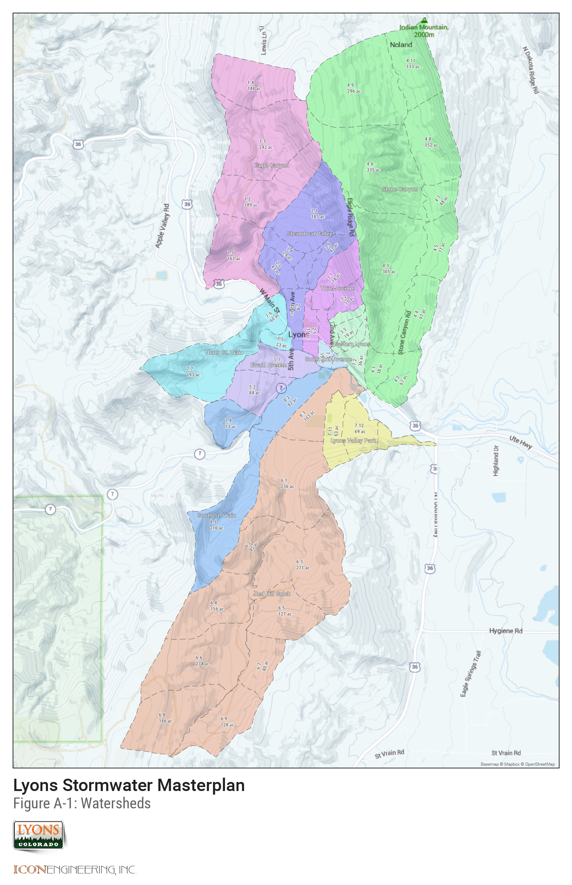
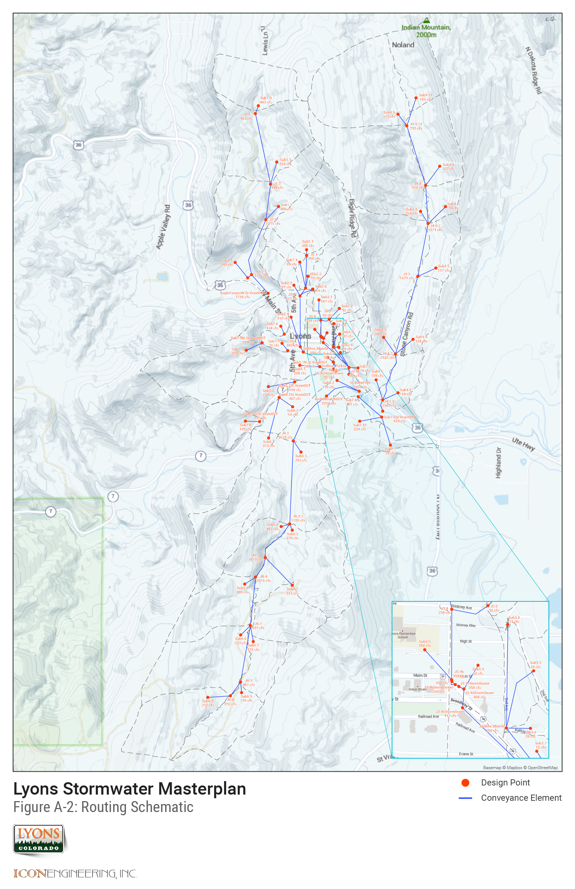
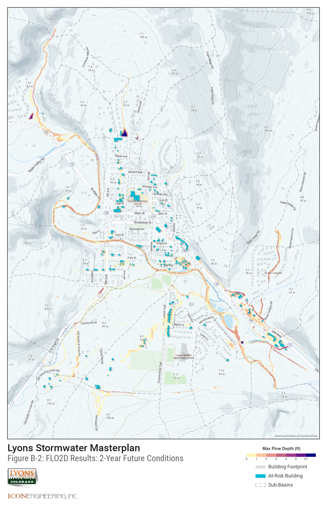
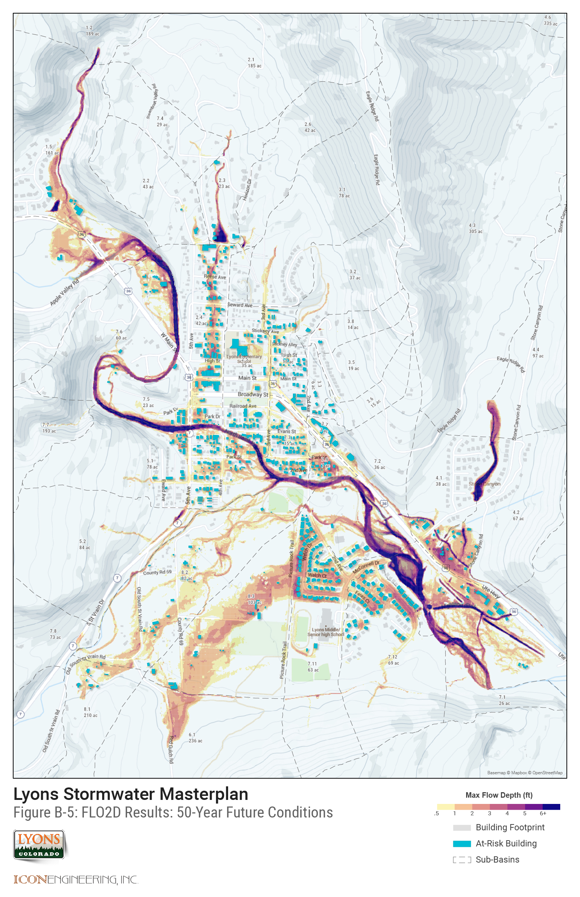
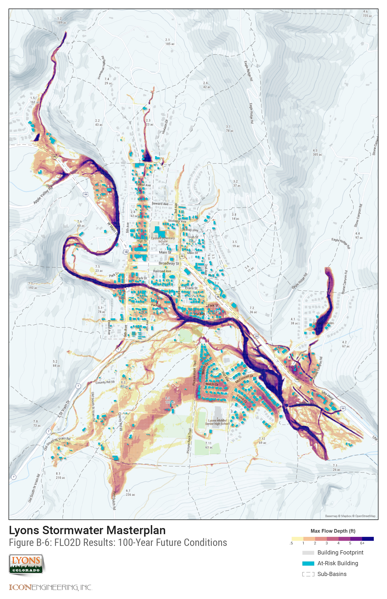
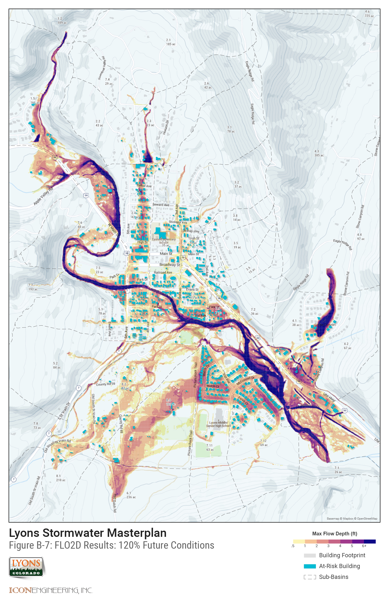
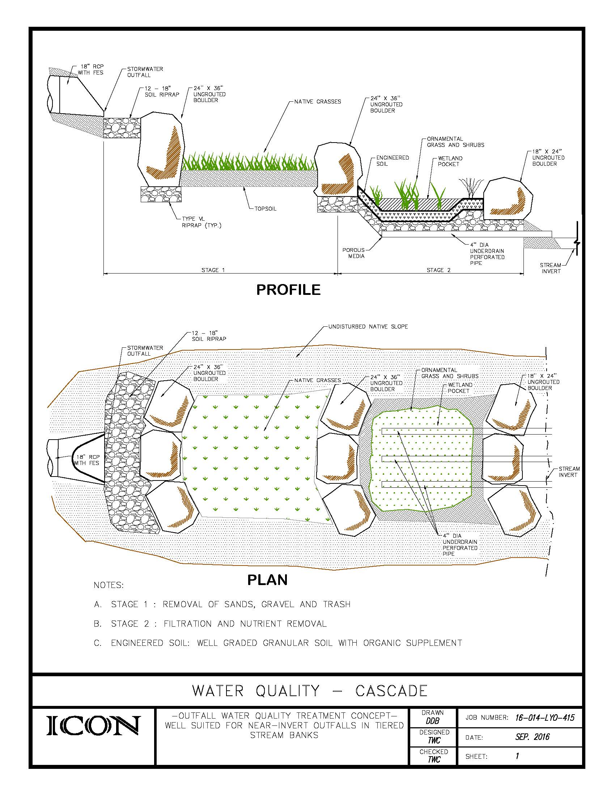
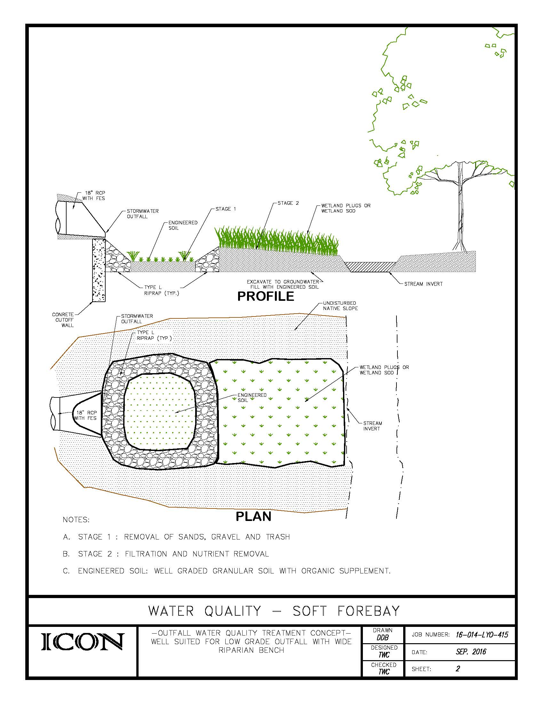
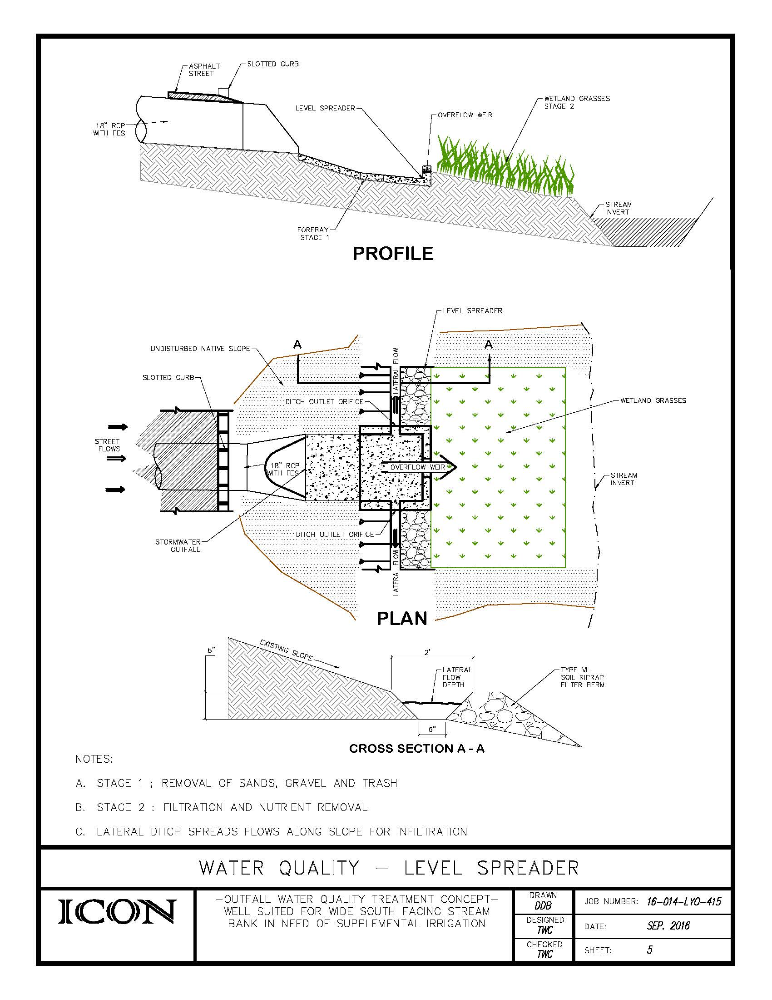
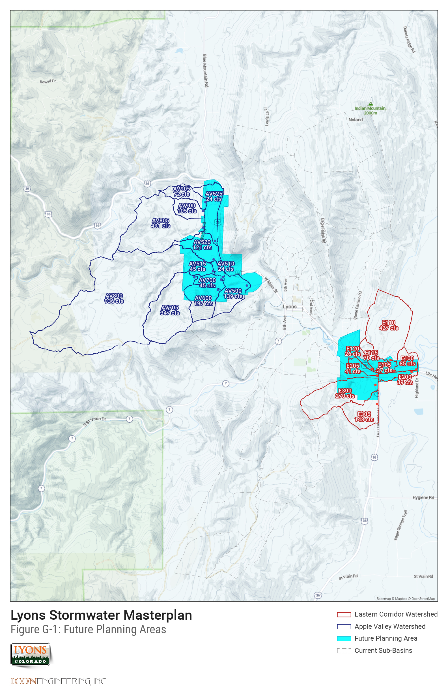

## Appendix A - HYDROLOGY

[{: .appendix-img }](assets/img/FigureA-1.jpg){: target="_blank" }   
*Watersheds Map*
{: .caption }

[{: .appendix-img }](assets/img/FigureA-2.jpg){: target="_blank" }   
*Routing Map*
{: .caption }

[Hydrology Report (Download PDF)](assets/img/Lyons_Hydrology_Report_October_2016.pdf){: target="_blank" data-action="download" }

[SWMM Results (Download PDF)](assets/img/SWMMResults.pdf){: target="_blank" data-action="download" }

## Appendix B - HYDRAULICS

[{: .appendix-img }](assets/img/FigureB-1.jpg){: target="_blank" }   
*Problem ID Map*
{: .caption }

[{: .appendix-img }](assets/img/FigureB-2.jpg){: target="_blank" }   
*FLO2D Results, 2-year*
{: .caption }

[{: .appendix-img }](assets/img/FigureB-3.jpg){: target="_blank" }   
*FLO2D Results, 5-year*
{: .caption }

[{: .appendix-img }](assets/img/FigureB-4.jpg){: target="_blank" }   
*FLO2D Results, 10-year*
{: .caption }

[{: .appendix-img }](assets/img/FigureB-5.jpg){: target="_blank" }   
*FLO2D Results, 50-year*
{: .caption }

[{: .appendix-img }](assets/img/FigureB-6.jpg){: target="_blank" }   
*FLO2D Results, 100-year*
{: .caption }

[{: .appendix-img }](assets/img/FigureB-7.jpg){: target="_blank" }   
*FLO2D Results, 120 pct.*
{: .caption }

## Appendix C - ALTERNATIVES ANALYSIS

[Conceptual Alternative Drawings (Download PDF)](assets/img/AppendixC_Alternatives.pdf){: target="_blank" data-action="download" }

[Conceptual Alternative Cost Estimates (Download PDF)](assets/img/AppendixC_Costs.pdf){: target="_blank" data-action="download" }

## Appendix D - WATER QUALITY

Water Quality Outfall Alternatives:

[{: .appendix-img }](assets/img/D-1-CASCADE.jpg){: target="_blank" }   
*Cascade*
{: .caption }

[{: .appendix-img }](assets/img/D-2-SOFT-FOREBAY.jpg){: target="_blank" }   
*Soft Forebay*
{: .caption }

[{: .appendix-img }](assets/img/D-3-LIVING-WALLS.jpg){: target="_blank" }   
*Living Walls*
{: .caption }

[{: .appendix-img }](assets/img/D-4-RAIN-GARDEN.jpg){: target="_blank" }   
*Rain Garden*
{: .caption }

[{: .appendix-img }](assets/img/D-5-LEVEL-SPREADER.jpg){: target="_blank" }   
*Level Spreader*
{: .caption }

[Water Quality (Download PDF)](assets/img/Water-Quality.pdf){: target="_blank" data-action="download" }

## Appendix E - DRAINAGE CRITERIA

[Addendum to USDCM (Download PDF)](assets/img/2016-Lyons-Addendum-to-USDCM.pdf){: target="_blank" data-action="download" }

## Appendix F - COLLECTED DATA

[Field Data Collection Inventory (Download PDF)](assets/img/LyonsDataCollection.pdf){: target="_blank" data-action="download" }

## Appendix G - FUTURE PLANNING AREAS

[{: .appendix-img }](assets/img/FigureG-1.jpg){: target="_blank" }   
*Future Planning Areas*
{: .caption }

[CUHP Input (Download PDF)](assets/img/AppendixG_Complete.pdf){: target="_blank" data-action="download" }
