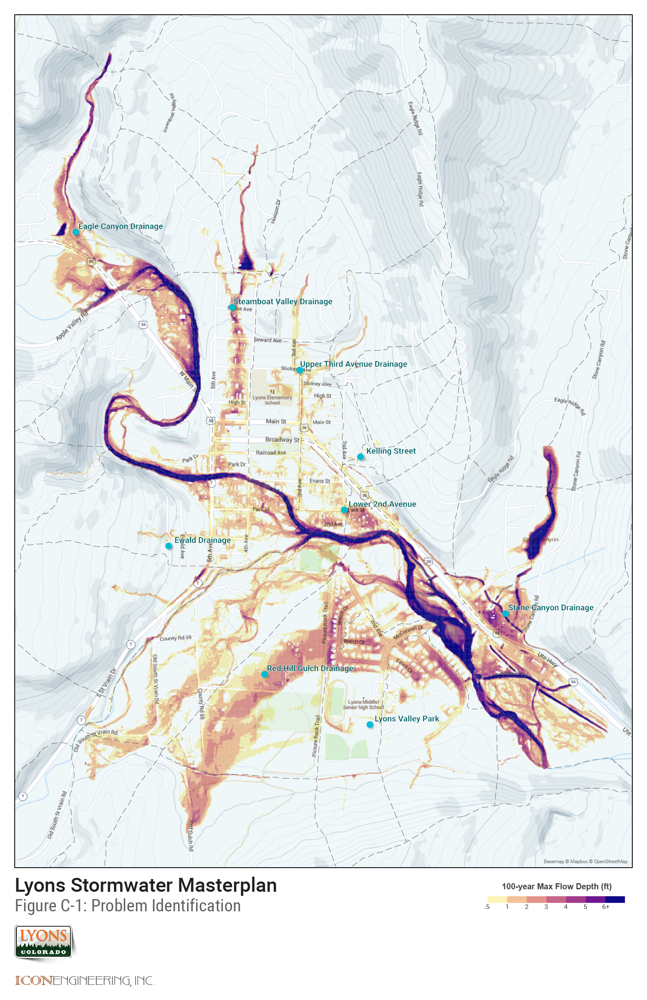
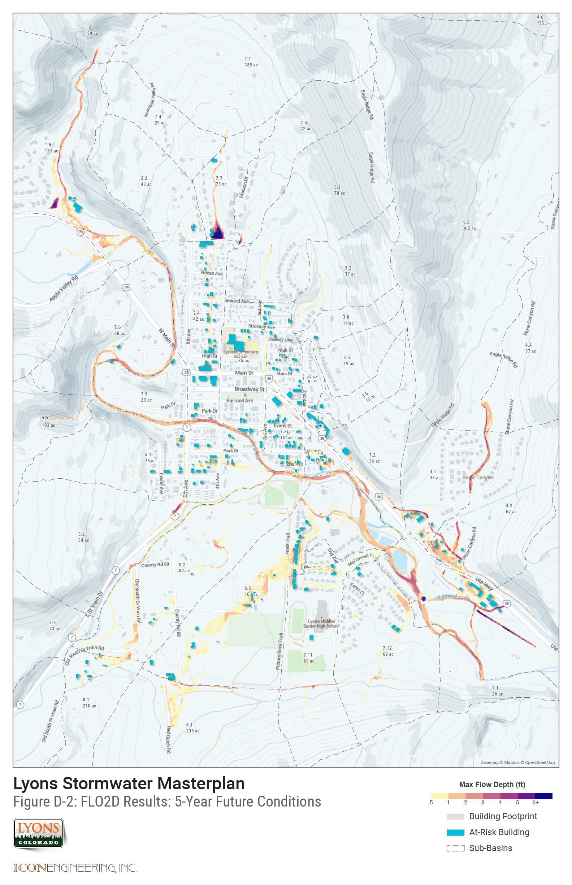
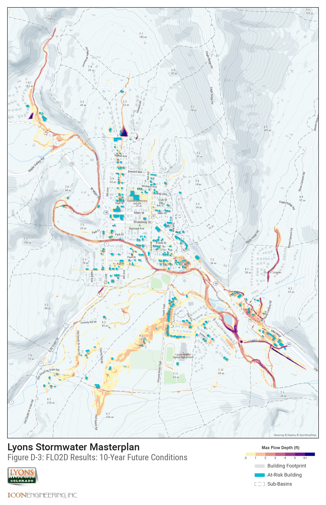
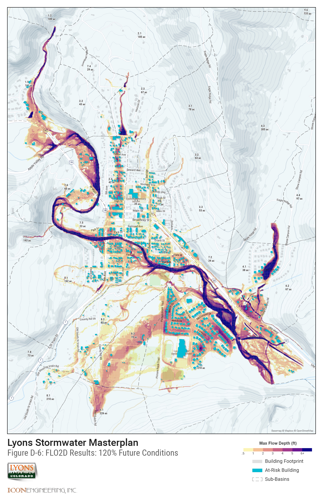
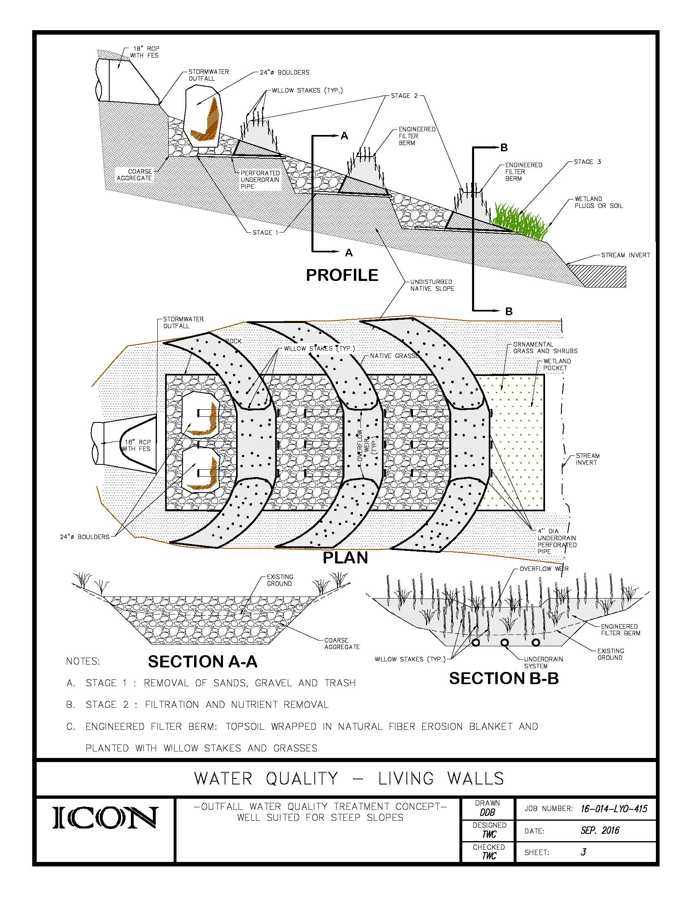
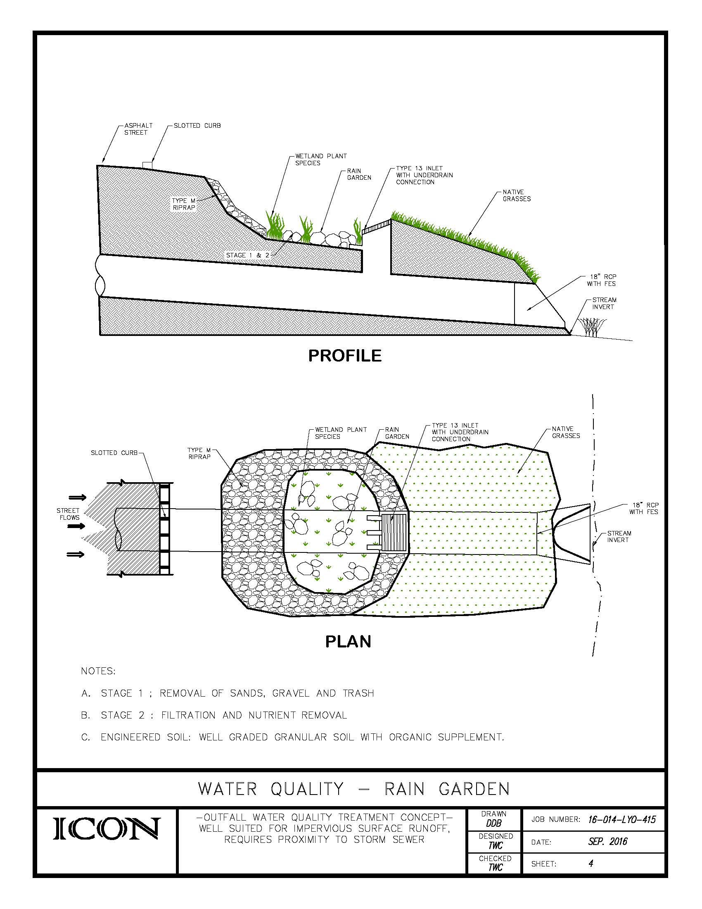

## Appendix A

[{: .appendix-img }](assets/img/FigureA-1.jpg){: target="_blank" }   
*Watersheds Map*
{: .caption }

## Appendix B

[Hydrology Report (Download PDF)](assets/img/Lyons_Hydrology_Report_October_2016.pdf){: target="_blank" data-action="download" } 

## Appendix C

[{: .appendix-img }](assets/img/FigureC-1.jpg){: target="_blank" }   
*Problem ID Map*
{: .caption }

## Appendix D

[{: .appendix-img }](assets/img/FigureD-1.jpg){: target="_blank" }   
*FLO2D Results, 2-year*
{: .caption }

[{: .appendix-img }](assets/img/FigureD-2.jpg){: target="_blank" }   
*FLO2D Results, 5-year*
{: .caption }

[{: .appendix-img }](assets/img/FigureD-3.jpg){: target="_blank" }   
*FLO2D Results, 10-year*
{: .caption }

[{: .appendix-img }](assets/img/FigureD-4.jpg){: target="_blank" }   
*FLO2D Results, 50-year*
{: .caption }

[{: .appendix-img }](assets/img/FigureD-5.jpg){: target="_blank" }   
*FLO2D Results, 100-year*
{: .caption }

[{: .appendix-img }](assets/img/FigureD-6.jpg){: target="_blank" }   
*FLO2D Results, 120 pct.*
{: .caption }

## Appendix E

[Alternative: Red Hill Gulch Lower Channel (Download PDF)](assets/img/RHG-IMPROV-60-SCALE-PLAN.pdf){: target="_blank" data-action="download" } 

## Appendix F

Red Hill Gulch Upper Diversion Channel - *forthcoming*

## Appendix G

Water Quality Outfall Alternatives:

[{: .appendix-img }](assets/img/G-1-CASCADE.jpg){: target="_blank" }   
*Cascade*
{: .caption }

[{: .appendix-img }](assets/img/G-2-SOFT-FOREBAY.jpg){: target="_blank" }   
*Soft Forebay*
{: .caption }

[{: .appendix-img }](assets/img/G-3-LIVING-WALLS.jpg){: target="_blank" }   
*Living Walls*
{: .caption }

[{: .appendix-img }](assets/img/G-4-RAIN-GARDEN.jpg){: target="_blank" }   
*Rain Garden*
{: .caption }

[{: .appendix-img }](assets/img/G-5-LEVEL-SPREADER.jpg){: target="_blank" }   
*Level Spreader*
{: .caption }

## Appendix H

[Water Quality (Download PDF)](assets/img/Water-Quality.pdf){: target="_blank" data-action="download" } 

## Appendix I

[Addendum to USDCM (Download PDF)](assets/img/2016-Lyons-Addendum-to-USDCM.pdf){: target="_blank" data-action="download" } 

## Appendix J

SWMM Modeling Files - *forthcoming*

## Appendix K

GIS Data - *forthcoming*