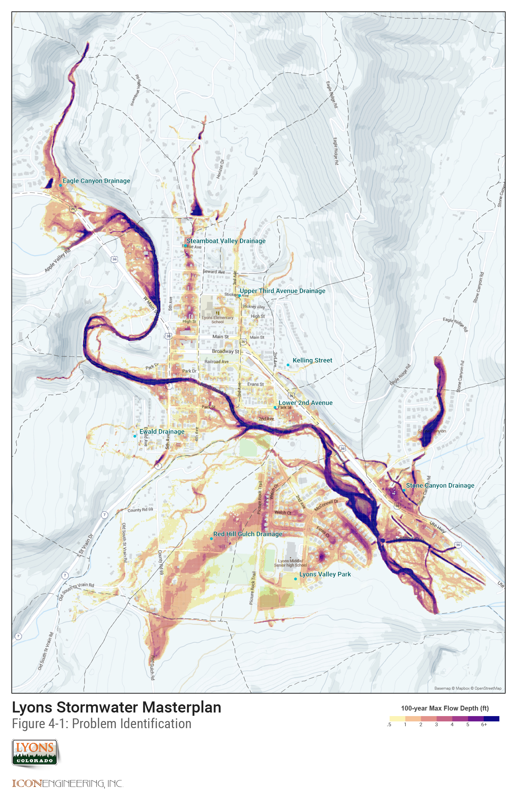

4.0 Hydraulic Analysis
======================

4.1 Previous Analysis and Events
--------------------------------

The information provided in the previous 1998 Drainage Master Plan study
was used to help identify flood hazards throughout the Town of Lyons.
The previous report identifies several key areas as having potential for
flooding hazards. A few key events are highlighted for reference.

In the August 1994 flood the Ewald Avenue subwatershed was observed to
produce enough runoff to carry debris off the hillside onto the
residential streets.

Steamboat Valley was identified as having the greatest impact to
flooding throughout the Town of Lyons. The report indicated the
Steamboat Valley Watershed was the hardest hit area during the 1994
storm. The existing storm drain system between 4th and
5th Avenue was estimated to be an approximate 5-year storm
capacity. The storage behind the old railroad embankment was identified
as an issue of major concern. The properties downstream of the railroad
embankment have grown reliant on this detention and removal of this
detention would have negative impacts to downstream property owners.
Several properties behind the railroad embankment were noted to be at
risk of flooding when the detention area was full.

The conveyance of Red Hill Gulch stormwater runoff in South Ledge Ditch
was identified as a possible flooding hazard. The report noted the
possibility of the ditch embankment to become compromised and the bank
to be breached with the conveyance of storm water runoff. It should be
noted that Lyons Valley Subdivision was not constructed at the time of
the previous report.

The 2013 flood event had a well-documented impact on the Town of Lyons.
The confluence of the north and south St. Vrain Rivers was the center of
flood damages during the 2013 floods. Several reports provide further
documentation of the flood event. Numerous post-flood studies on the
floodplain and restoration projects are also available.

A 2015 flood event was notable because of the hail associated with the
storm. The resulting hail-laden runoff clogged surface conveyance
(streets, gutters) as well as capture systems (inlets, outlet
structures).

4.2 Evaluation of Existing Facilities
-------------------------------------

Existing storm drain infrastructure was evaluated to determine the
approximate design storm frequency. A summary of existing infrastructure
is provided in the GIS data provided in *Appendix K. (or on web map
application at www...)*

FLO-2D software is a two-dimensional flood routing model that was used
to identify residual flood potential with the watershed. FLO-2D
simulates channel flow, unconfined overland flow and street flow over
complex topology. The model uses the full dynamic wave momentum equation
and a central finite difference routing scheme with eight potential flow
directions to predict the progression of a floodwave over a system of
square grid elements. The development of the FLO-2D model is further
discussed below.

#### 4.2.1 Flo-2D Model Development

10-foot by 10-foot grid cells were used to maximize the precision in
identifying flooding potential throughout the watershed. Elevations for
each grid cell were computed through FLO-2D by interpolating the project
LiDAR data. Building obstructions were incorporated into the FLO-2D
model based on building footprint data that was generated as part of
this study.

Individual subwatershed hydrographs were taken from the hydrology model
(CUHP) and applied to the FLO-2D surface. Each hydrograph was applied at
a single FLO-2D grid cell where the majority of discharges were expected
to converge for each subwatershed. Existing storm drain systems 24-inch
and larger were included in the FLO-2D model.

Separate FLO-2D models were used to distinguish the flooding potential
for the study area for each of the design storms.

The results of these models are provided in *Appendix D*. (And also on
the web map at www...)

4.3 Flood Hazards
-----------------

FLO-2D uses the full dynamic wave momentum equation when computing flow
depth at each cell in the study area. This computational methodology
accounts for floodplain storage at each sump location in the watershed
attenuating flows as they traverse the watershed downstream. This
floodplain storage is not accounted for in the SWMM model which is
computed using a kinematic wave approach. This difference in modeling
approach leads to discrepancies when comparing design peak flows from
the SWMM model and the inundation limits shown in the hydraulic
analysis. Existing capacity for each outfall system was estimated from
normal depth calculations given each pipe slope. The existing storm
drain infrastructure generally lacks the capacity to adequately convey
the 5-year storm event.

This is not unusual for a town the age and size of the Town of Lyons.
Land use regulations and stormwater management policies were not common
to smaller towns along the Front Range of Colorado until sometime after
the 1965 flood on the South Platte River ravaged metro Denver. By the
time development regulation and stormwater infrastructure
recommendations expanded to include smaller towns along the Front Range,
a lot of Lyons' roadways and private development had encroached on the
natural drainageways.

[{: .center-img }](assets/img/Figure4-1.jpg){: target="_blank" }
*Figure 4-1: Problem ID Map*
{: .caption }

#### 4.3.1 Eagle Canyon

The most significant flooding hazard in the Eagle Canyon Watershed is
just upstream of the confluence with North St. Vrain Creek. Development
immediately upstream of the confluence has limited the capacity of the
channel. By limiting the ability of the channel to convey water to North
St. Vrain, the discharge overtops Main Street and spills to the south.

#### 4.3.2 Eastern Lyons

The small swale and private roadway culverts along the east side of
2nd Avenue limit the capacity to convey the basin runoff
downstream. With no storm drain or curb and gutter system installed
along 2nd Avenue, all basin runoff will flow along
2nd Avenue on the street. As mentioned previously, during
major events runoff from the Eastern Lyons watershed any flow
overtopping 2nd Avenue will flow west and contribute flow to
the Third Avenue Watershed.

In the lower reaches of Eastern Lyons Watershed the businesses along
Main Street and residences along Kelling Drive have experienced flooding
in the past. The only storm drain intercepting flow near the businesses
is an 18-inch storm drain. This system can capture less than the 5-year
design flow in ideal, free flow, no debris conditions.

#### 4.3.3 Ewald Ave

As noted in the previous study, the steep slopes of the Ewald Ave
Watershed pose a flooding hazard to the residential development in the
lower portions of the watershed. The steep slopes in the upper portion
of the watershed result in high velocities of runoff eroding the
hillside and carrying debris into the residential development.

#### 4.3.4 Lyons Valley Park

Flooding hazards in the Lyons Valley Park Watershed are a result of
development within the basin without adequate storm drain conveyance.
The 18-inch storm drain throughout the upper reaches of the development
was not design to convey major storm events.

A significant flooding hazard for the Lyons Valley Park Watershed is
overflow from the Red Hill Gulch Watershed. The overflow drainage path
from Red Hill Gulch is discussion in further detail below.

An overflow path from the hillside south of the High School is an
interesting problem. The modeling scenarios do not account for the
irrigation ditch that traverses the hillside near the toe of slope. This
is a common hydraulic modeling assumption to account for a runoff event
during a ditch full scenario. However, in a practical sense the
irrigation ditch catches most minor storm events and effectively
protects the adjacent residential structures. At a minimum, the ditch
should be monitored for stability to ensure overflows and spills from
stormwater are handled safely. Additional planning for a time when the
ditch is no longer operational or maintained should be considered.
Finally, protection or enhancement of the minor swale along the rear lot
lines of the neighborhood should be considered to ensure sheet flows are
passed around the structures.

#### 4.3.5 North St. Vrain

Flooding hazards in the North St. Vrain Watershed are limited to the
lower end of the basin. Generally flows in this basin concentrate in
natural valleys and are conveyed overland towards the St. Vrain River.

#### 4.3.6 Red Hill Gulch

The most significant flooding hazard in the Red Hill Gulch Watershed is
flow overtopping the South Ledge Ditch and flow continuing north into
Bohn Park and Lyons Valley Subdivision. Utilizing the ditch for
intercepting and conveying stormwater runoff creates a significant
hazard for downstream properties. These comingled flows exceed the
design capacity of the canal jeopardizing the structural integrity of
the ditch. Flows overtopping the ditch create an uncontrolled overflow
impacting Bohn Park and homes in the Lyons Valley Subdivision.

#### 4.3.7 South St. Vrain

Flooding hazards in the South St. Vrain Watershed are generally created
by the lack of a formal drainage conveyance system. The topography
within these watersheds conveys the runoff in separate flow paths to
South St. Vrain Creek.

#### 4.3.8 South 2nd Avenue

Flood hazards within the South 2nd Avenue Watershed are
caused by contributing flow from other watersheds, lack of local runoff
storm drain conveyance, and proximity to St. Vrain Creek. The elliptical
pipe underneath Main Street conveys runoff from the Third Avenue
Watershed to the South 2nd Avenue Watershed. The pipe
discharges flow into an undersized open channel that conveys flow
southeast towards 2nd Avenue. Any flow that is not
intercepted by the 24-inch storm drain at 2nd Avenue spills
to the south impacting properties. The 18-inch storm drain at
2nd Avenue and Park Street intercepts approximately the XX
design flow for the subwatershed, impacting more properties.

#### 4.3.9 Steamboat Valley

The most significant flood hazard impacting downtown Lyons is runoff
from Steamboat Valley. The runoff from the upper watershed concentrates
behind the old railroad embankment. The area behind the old railroad
embankment poses a significant flood hazard to downstream properties.
Close observation on the stability and maintenance of this embankment is
important to managing the risk of a breach or other failure during a
storm event. This will require coordination with several private
property owners. Downstream of the railroad embankment development
within the natural drainage path has confined the runoff to an
undersized open channel through private property. The lack of conveyance
capacity of this channel and culvert roadway crossings between
4th Avenue and 5th Avenue creates a flooding
hazard damaging private property. Any flow that is not intercepted by
the historic stone culvert continues on the surface flowing through
backyards with additional impact to private property and structures.

The existing conveyance within Steamboat Valley does not have the
hydraulic capacity to convey storms greater than the 5-year return
period. More importantly, the materials (stone and open channel) and
alignment (erratic with several sharp bends and constrictions) subjects
the adjacent properties to additional risk from debris clogging.

#### 4.3.10 Stone Canyon

The steep natural drainageway in the Stone Canyon Watershed conveys the
runoff into the open space of the Stone Canyon Subdivision without
significant flood hazards. The roadway crossing at Stone Canyon Road
conveys the flow downstream without impacting a significant number of
residences within the subdivision. Development downstream of Stone
Canyon Road has eliminated the conveyance capacity of the channel to
convey runoff without impacting properties. The water backs up against
Ute Highway as water is conveyed underneath the roadway through the box
culvert.

There have been reports of soil subsidence in the open space areas
adjacent to the channel. This study did not include detailed
geotechnical analysis to determine a cause or effect of the reported
soil movement. More formal identification of the problem areas, formal
and regular monitoring of those sites, and geotechnical analysis would
be required to properly evaluate the risk of those soils relative to
flood hazards (i.e. bank failure reducing channel capacity), private, or
public property.

#### 4.3.11 Third Avenue

Runoff from the undeveloped upper watershed enters the downtown in two
distinct locations. East of the cemetery flow drains south into the
developed area of the watershed along Third Avenue. Flow from the
eastern portion of the watershed flows into the downtown area west along
Stickney Avenue before turning south on Third Avenue. The runoff from
the watershed continues south along Third Avenue where the majority of
the flow is conveyed in the street. The elliptical pipe at Main Street
conveys flow underneath Main Street into the South 2nd Avenue
Watershed. Flows exceeding the capacity of the elliptical pipe split
with some flow continuing southeast north of Main Street while some flow
overtops Main Street and continues flowing down Third Street.
